<!--
author: Andre Dietrich
language: de
narrator: Deutsch Female
mode:     Slides
version: 0.1.0
edit: true
date: 2025-08-20
title: Haus und Brandschutzordnung BSTZ Pirna
comment: Berufsbildungs- und Technologiezentrum Pirna

tags: Belehrung

-->

# Haus- und Brandschutzordung

Berufsbildungs- und Technologiezentrum Pirna
--------------------------------------------

> Hallo liebe Kursteilnehmer, in Vorbereitung unserer gemeinsamen Arbeit werden wir nun zunächst die Ordnungen der Handwerkskammer Dresden gemeinsam durcharbeiten und dabei auf die für diese Veranstaltung zentralen Vorgaben eingehen. Dafür habe ich zwei Abschnitte vorgesehen, die wir nun Schritt für Schritt thematisieren. Diese umfasst die Belehrung aber auch allgemeine Hinweise zum Gelände des Ausbildungszentrums. 

Haus- und Werkstattordnung bezeichnet eine Sammlung von Regeln und Vorschriften, die für das Verhalten und die Nutzung von Räumlichkeiten in einem Gebäude oder einer Werkstatt gelten. Sie legt fest, welche Sicherheitsmaßnahmen einzuhalten sind, welche Verantwortlichkeiten bestehen und welche Verhaltensweisen erwartet werden, um einen geordneten und sicheren Betrieb zu gewährleisten.

__Klicken Sie unten auf den Pfeilen, um im Dokument zu navigieren.__

## I. Allgemeine Hausordnung

    --{{0}}--
Verhalten im Brandfall und bei gefahrdrohenden Situationen:
!?[Belehrung1](media/Belehrung_1.webm#t=0,5)

    --{{1}}--
Verlassen Sie das Gebäude auf dem kürzesten Fluchtweg, entsprechend Flucht- und Rettungsplan, benutzen Sie keinen Aufzug, unterstützen Sie Behinderte.
!?[Belehrung1](media/Belehrung_1.webm#t=5,16)

     {{1-2}}
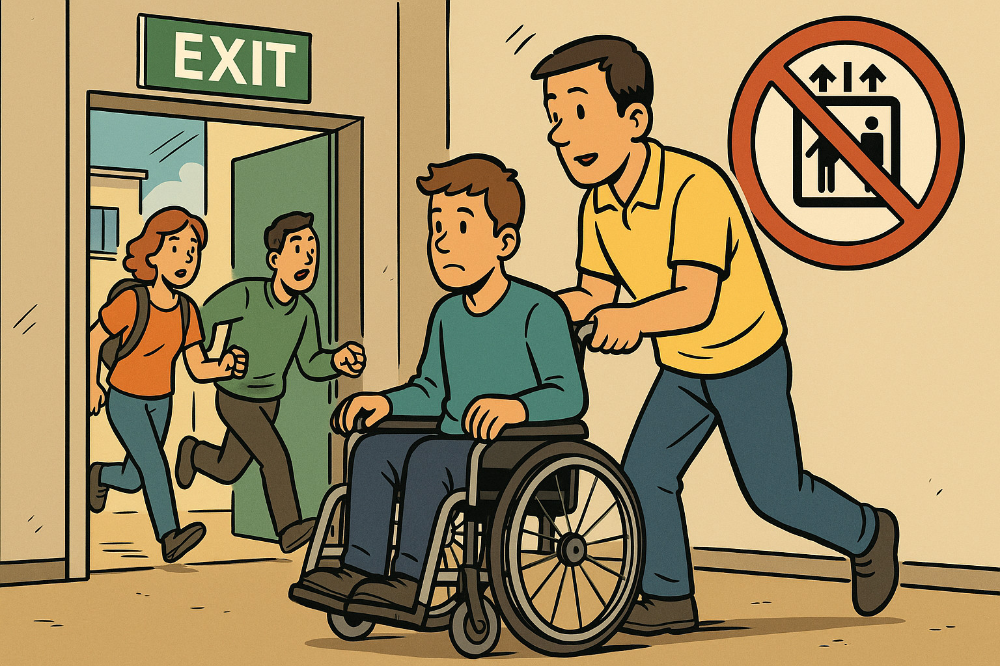

    --{{2}}--
Sammeln Sie sich sofort an ausgewiesenen Sammelstellen.
!?[Belehrung1](media/Belehrung_1.webm#t=16,21)

     {{2-3}}
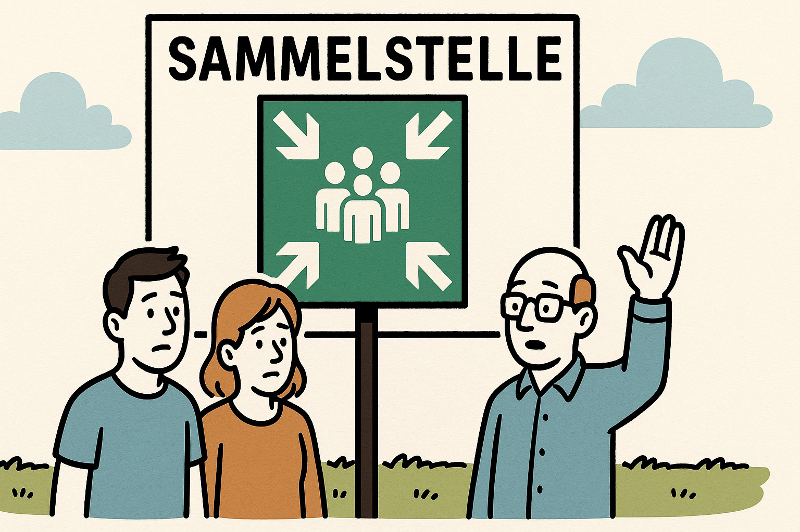

    --{{3}}--
In Brand geratenen elektrischen Anlagen oder Geräte sind vom Netz zu trennen.
!?[Belehrung1](media/Belehrung_1.webm#t=22,27)

     {{3-4}}

    --{{4}}--
Verletzungen sind von den Ersthelfern zu versorgen und in das Erste-Hilfe-Buch einzutragen.
!?[Belehrung1](media/Belehrung_1.webm#t=28,34)

     {{4-5}}

    --{{5}}--
Der Empfänger von Bombendrohungen hat sofort seinen Vorgesetzten über die Art und den Inhalt der Drohung zu informieren.
!?[Belehrung1](media/Belehrung_1.webm#t=35,44)

     {{5-6}}

    --{{6}}--
Im Falle eines Amoklaufs ist die Polizei (110) und die Verwaltung des BTZ Pirna (intern 471 oder extern 3501 4618870) zu informieren.
!?[Belehrung1](media/Belehrung_1.webm#t=44,60)

     {{6-7}}
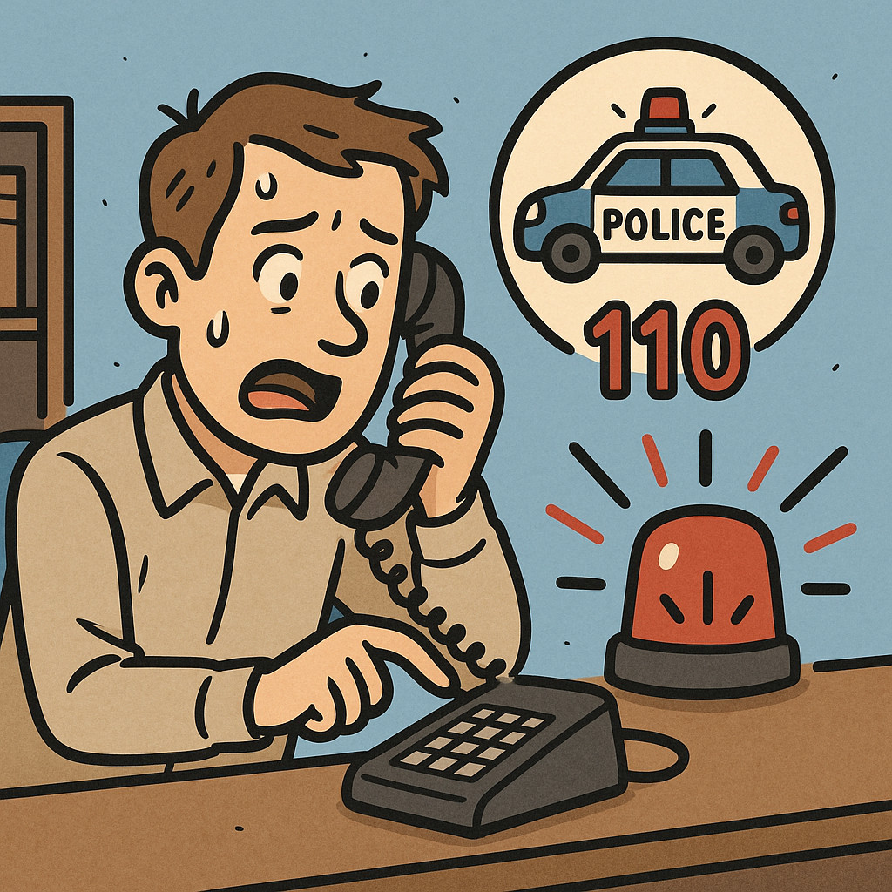

    --{{7}}--
Das Tragen und Nutzen von Zeichen und Materialien (Bekleidung, Bild- und Tonträgern, Bücher, Grußformen, Parolen, Propagandamittel und Formulierungen der Volksverhetzung u.a.), die darauf schließen lassen, dass ein Kontakt zu extremistischem Gedankengut bzw. Gruppierungen besteht, ist verboten.
!?[Belehrung1](media/Belehrung_1.webm#t=60,83)

     {{7-8}}
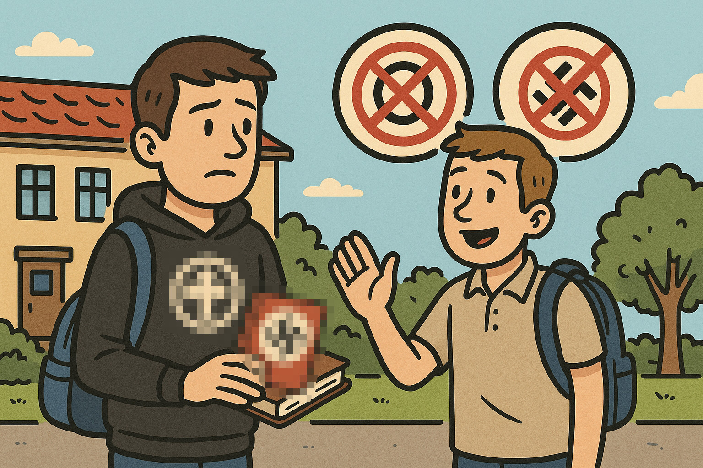

    --{{8}}--
Das Rauchen ist, mit Ausnahme in den festgelegten Raucherzonen, im gesamten Objekt verboten.
!?[Belehrung1](media/Belehrung_1.webm#t=84,91)

     {{8-9}}

    --{{9}}--
Der Konsum von alkoholischen Getränken und sonstiger Rauschmittel ist grundsätzlich verboten.
Dieses Verbot schließt den Vertrieb oder die Weitergabe sonstiger Rauschmittel ein.
Verstöße gegen das Betäubungsmittelgesetz werden zur Anzeige gebracht.
!?[Belehrung1](media/Belehrung_1.webm#t=92,109)

     {{9-10}}

    --{{10}}--
Waffen jeglicher Art, auch Schreckschuss- oder Luftdruckwaffen, sind im Objekt verboten.
!?[Belehrung1](media/Belehrung_1.webm#t=110,116)

     {{10-11}}
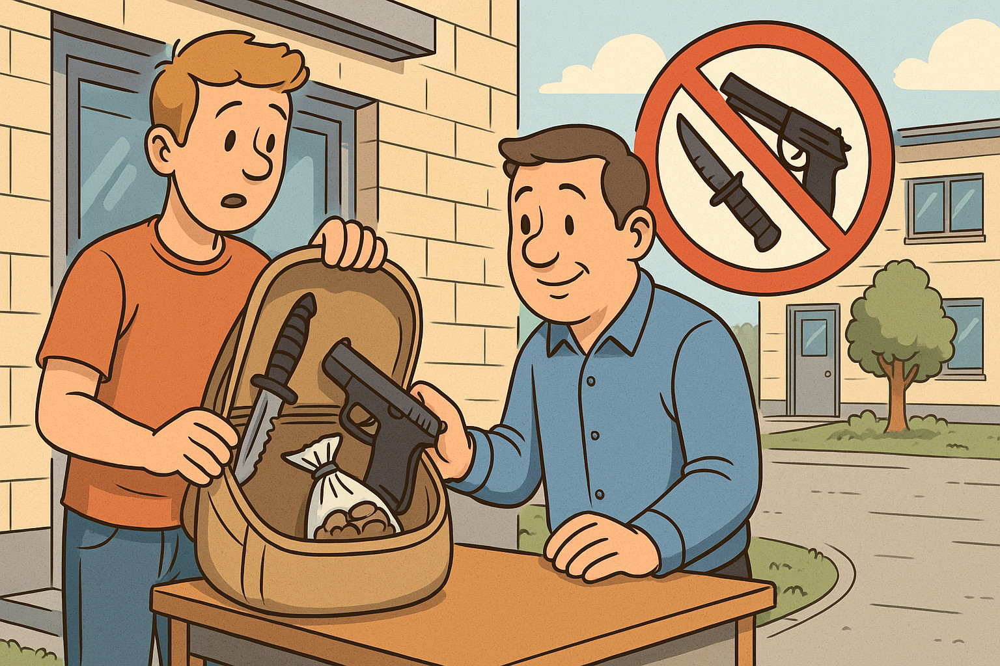

    --{{11}}--
Im Gelände gilt die STVO, das Abstellen von Fahrzeugen geschieht auf eigene Gefahr.
Widerrechtlich abgestellte Fahrzeuge werden kostenpflichtig abgeschleppt.
Außerhalb der Lehrgangszeiten sind die Einfahrtstore geschlossen.
In dieser Zeit sind das Befahren des Geländes mit Kraftfahrzeugen sowie das Parken grundsätzlich nicht gestattet.
!?[Belehrung1](media/Belehrung_1.webm#t=117,141)

     {{11-12}}
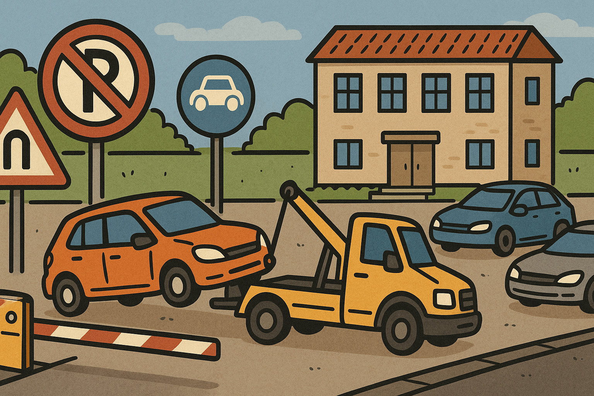

    --{{12}}--
Die Handwerkskammer Dresden haftet nicht für abhanden gekommene Sachen und Wertgegenstände (Bekleidung, Wertsachen, etc.).
!?[Belehrung1](media/Belehrung_1.webm#t=142,151)

     {{12-13}}
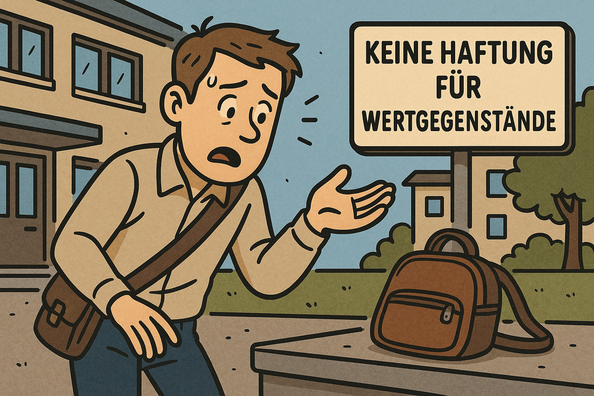

    --{{13}}--
Während des Unterrichts und bei Prüfungen sind Handys grundsätzlich abzuschalten.
!?[Belehrung1](media/Belehrung_1.webm#t=152)

      {{13}}

### Wissenstest

    {{0-1}}
<section>

__Was ist im Brandfall zu tun?__

<!-- --{{0}}--
Was ist im Brandfall zu tun? -->

- [[x]] Gebäude auf kürzestem Fluchtweg verlassen, keinen Aufzug benutzen
- [[ ]] Zunächst persönliche Sachen aus dem Raum holen
- [[ ]] Auf den Aufzug warten
- [[x]] Behinderten Menschen helfen

</section>

    {{1-2}}
<section>

__Ordnen Sie die Situationen den richtigen Verhaltensweisen zu.__

<!-- --{{1}}--
Ordnen Sie die Situationen den richtigen Verhaltensweisen zu. -->

<!-- data-randomize="true" -->
| Situation     | Verhaltensweise                                                   |
| ------------- | ----------------------------------------------------------------- |
| Sammelstelle  | [->[(Sofort nach Evakuierung aufsuchen)]]                         |
| Erste Hilfe   | [->[(Verletzungen versorgen und ins Erste-Hilfe-Buch eintragen)]] |
| Bombendrohung | [->[(Sofort Vorgesetzten informieren)]]                           |
| Amoklauf      | [->[(Polizei (110) und Verwaltung benachrichtigen)]]              |

</section>

    {{2}}
<section>

__Welche Aussagen zur Hausordnung sind korrekt?__

<!-- --{{2}}--
Welche Aussagen zur Hausordnung sind korrekt? -->

- [[x]] Rauchen ist nur in ausgewiesenen Zonen erlaubt.  
- [[ ]] Alkoholische Getränke dürfen in Pausen konsumiert werden.  
- [[x]] Waffen jeglicher Art sind verboten.  
- [[ ]] Handys dürfen während Prüfungen eingeschaltet bleiben.

</section>

## II. Werkstatt- und Laborordnung

    --{{0}}--
Den Weisungen der Lehrer/Ausbilder ist unbedingt Folge zu leisten.
!?

     {{0-1}}
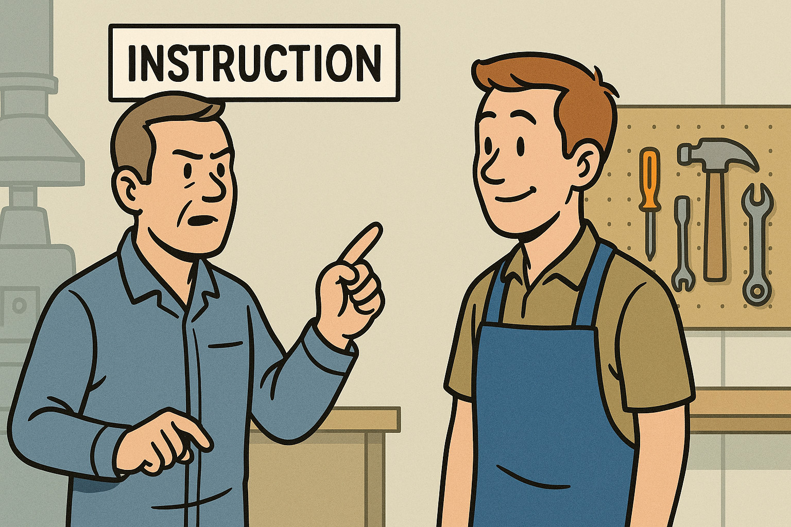

    --{{1}}--
Die Bedienung der Unterrichtstechnik obliegt ausschließlich den Dozenten.
!?

     {{1-2}}
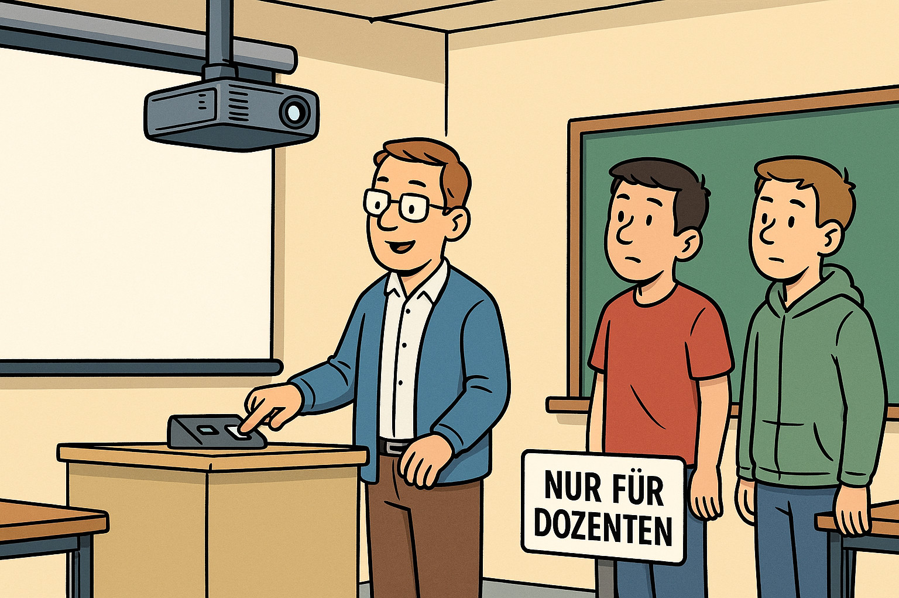

    --{{2}}--
Sicherheits- und Arbeitsschutzbestimmungen sowie Werkstattordnungen und Belehrungen des Ausbilders sind einzuhalten.
!?

     {{2-3}}
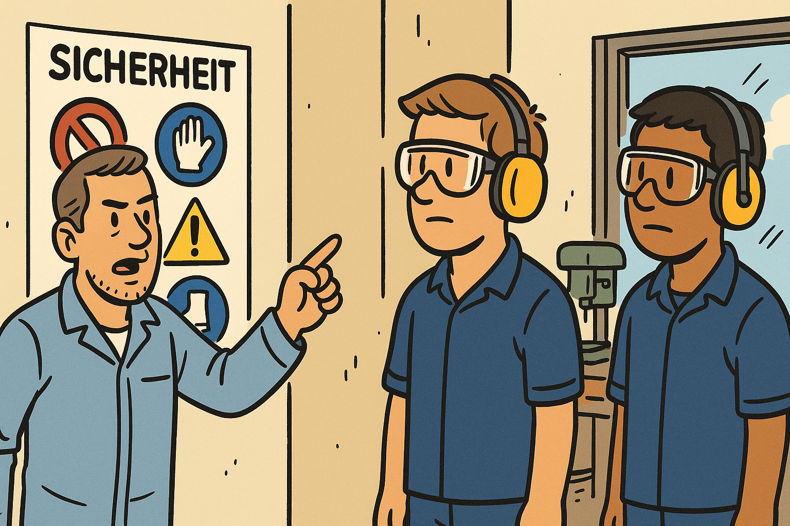

    --{{3}}--
In den Werkstätten, Computerkabinetten bzw. Laboren ist das Essen nicht gestattet.
Nutzen Sie die Pausenecken bzw. den Speisesaal.
!?

     {{3-4}}

    --{{4}}--
Die Aufstellung der Tische und Stühle in den Seminarräumen ist beizubehalten.
!?

     {{4-5}}
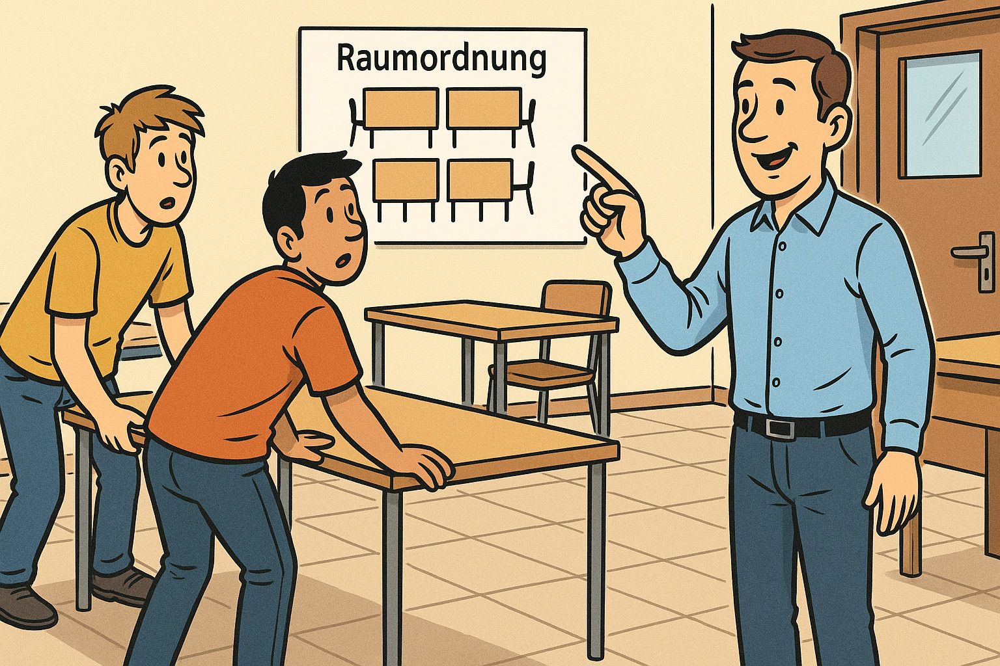

    --{{5}}--
Der Aufenthalt in Werkstätten und Labors sowie im Computerkabinett sowie das Arbeiten am Computer sind nur in Anwesenheit und nach Aufforderung des Dozenten/Ausbilders gestattet.
!?

     {{5-6}}
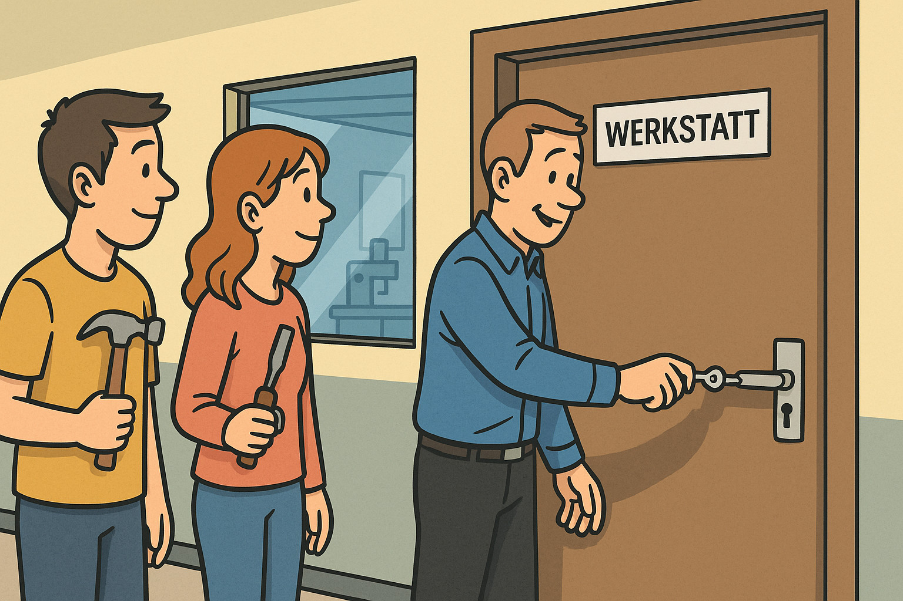

    --{{6}}--
Es ist unzulässig selbständig Software auf dem Computer zu installieren oder Kopien installierter Software zu erstellen.
Des Weiteren ist das Herunterladen von Daten jeglicher Art aus sowie das Surfen auf pornographischen, gewaltverherrlichenden oder extremistischen Seiten im World Wide Web verboten.
!?

     {{6-7}}
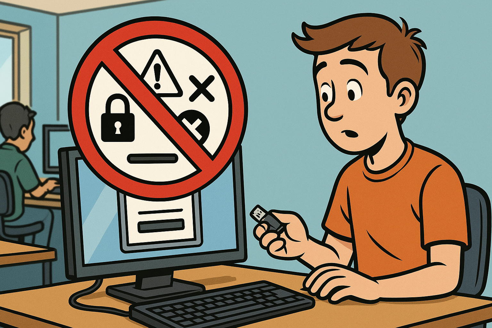

    --{{7}}--
Gewaltanwendungen jeglicher Art sind verboten.
Teilnehmer haften für mutwillig beschädigte oder entwendete Werkstatt- bzw. Laboreinrichtungen und Gegenstände in Höhe des Wiederbeschaffungswertes.
!?

     {{7-8}}

    --{{8}}--
Die Werkstätten des BTZ Pirna dürfen nur mit Arbeitsschutzbekleidung sowie Arbeitsschutzschuhen betreten werden.
!?

     {{8-9}}
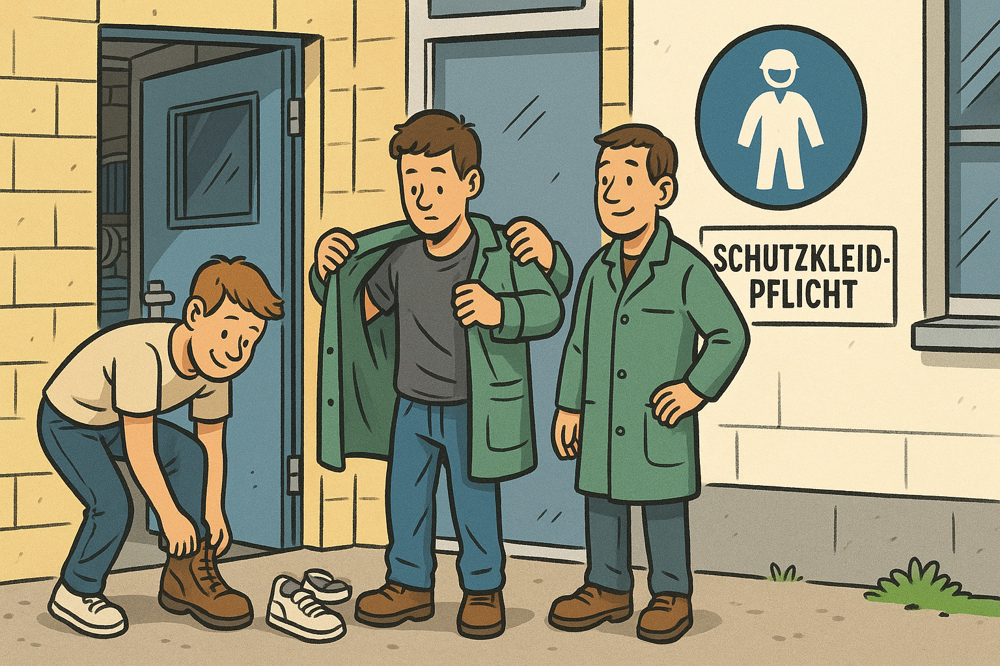

    --{{9}}--
Die jeweils geltenden aushängenden Betriebsanweisungen sind zu beachten.
!?

     {{9-10}}
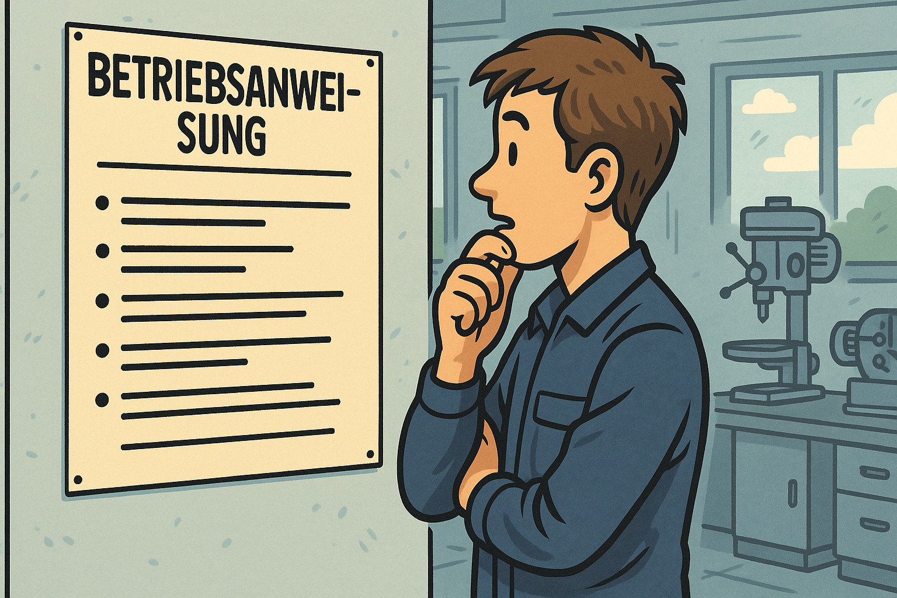

    --{{10}}--
Bei Fehlzeiten während der Ausbildung sind entsprechende Nachweise zu erbringen.
!?

     {{10-11}}

    --{{11}}--
Beim Verlassen des Objekts ist der zuständige Ausbilder zu informieren, ohne Abmeldung kein Versicherungsschutz.
!?

     {{11-12}}
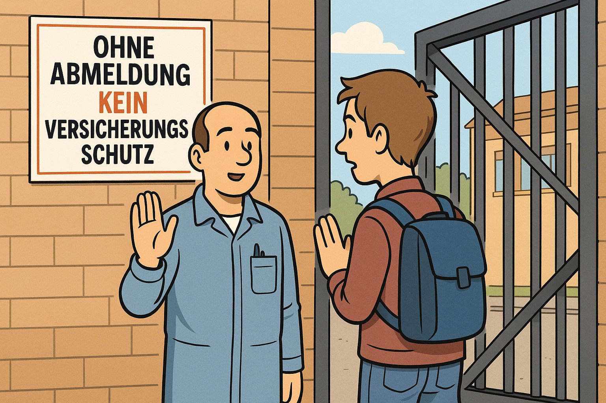

    --{{12}}--
Im Übrigen gilt die öffentliche aushängende Haus- und Brandschutzordnung der Handwerkskammer Dresden in der jeweils gültigen Fassung.
!?

     {{12-13}}
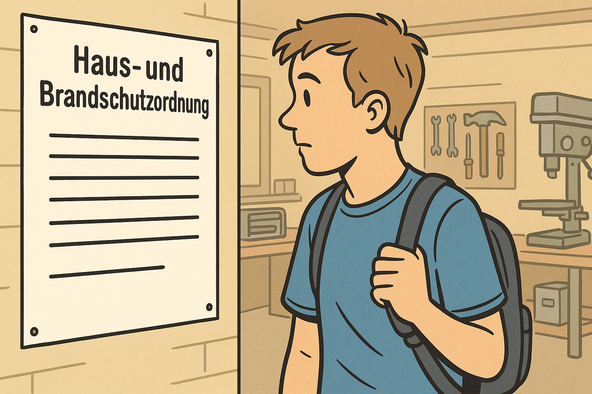

    {{|> 13}}
> __Berücksichtigung von Beeiträchtigungen__
>
> Bitte informieren Sie Ihren Ausbilder über individuelle Beeinträchtigungen (z.B. Medikamenteneinnahme, körperliche Behinderungen), die bei der Durchführung des ÜLU-Kurses berücksitigt werden müssen.
>
> Diese Information wir selbstverständlich vertraulich behandelt.

### Wissenstest

    {{0-1}}
<section>

__Welche Regeln gelten in Werkstätten und Laboren?__

<!-- --{{0}}--
Welche Regeln gelten in Werkstätten und Laboren? -->

- [[x]] Essen ist dort verboten.
- [[ ]] Software darf eigenständig installiert werden.
- [[x]] Sicherheits- und Arbeitsschutzbestimmungen müssen eingehalten werden.
- [[ ]] Man darf auch ohne Dozent/Ausbilder arbeiten.

</section>

    {{1-2}}
<section>

-----------------------------

__Ordnen Sie die Vorschriften den richtigen Bereichen zu.__

<!-- --{{1}}--
Ordnen Sie die Vorschriften den richtigen Bereichen zu. -->

<!-- data-randomize -->
Arbeitsschutzkleidung -> [->[(Pflicht beim Betreten der Werkstätten)]]\
Dozenten              -> [->[(Bedienung der Unterrichtstechnik)]]\
Teilnehmer            -> [->[(Haften für mutwillige Beschädigungen)]]\
Ausbilder             -> [->[(Muss beim Verlassen des Objekts informiert werden)]]

</section>

    {{2}}
<section>

-----------------------------

__Welche Aussagen sind richtig oder falsch?__

<!-- --{{2}}--
Welche Aussagen sind richtig oder falsch? -->

- [[x]] In Werkstätten darf nur unter Aufsicht des Ausbilders gearbeitet werden.  
- [[ ]] Das Surfen auf beliebigen Internetseiten ist erlaubt.  
- [[x]] Gewaltanwendungen jeglicher Art sind verboten.  
- [[ ]] Die Aufstellung der Tische und Stühle darf beliebig verändert werden.  

</section>
