<!--
language: de
narrator: Deutsch Female
-->

# Haus- und Brandschutzordung

Berufsbildungs- und Technologiezentrum Pirna
--------------------------------------------

Lehrgang: TSM3/99

## I. Allgemeine Hausordnung

    --{{0}}--
Verhalten im Brandfall und bei gefardrohenden Situationen:

    --{{1}}--
Verlassen Sie das Gebäude auf dem kürzesten Fluchtweg, entsprechend Flucht- und Rettungsplan, benutzen Sie keinen Aufzug, unterstützen Sie Behinderte.

     {{1-2}}

    --{{2}}--
Sameln Sie sich sofort an ausgewiesenen Sammelstellen.

     {{2-3}}
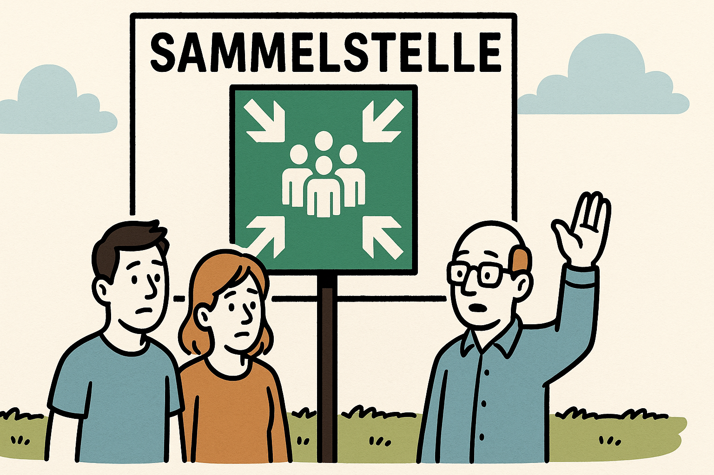

    --{{3}}--
In Brand geratenen elektrischen Anlagen oder Geräte sind vom Netz zu trennen.

     {{3-4}}
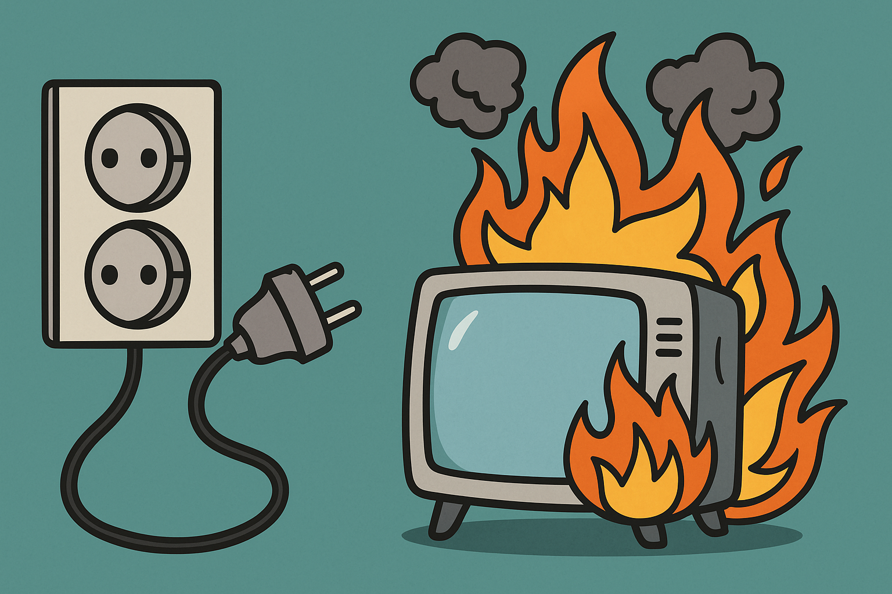

    --{{4}}--
Verletzungen sind von den Ersthelfern zu versorgen und in das Erste-Hilfe-Buch einzutragen.

     {{4-5}}
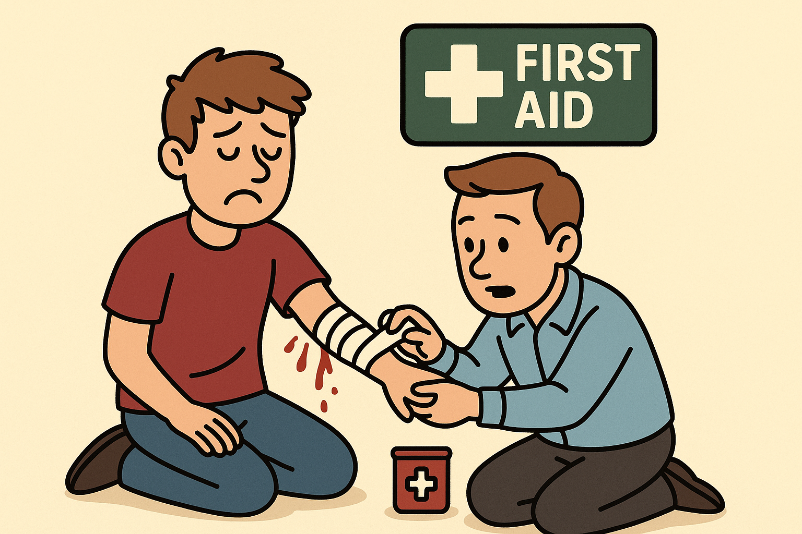

    --{{5}}--
Der Empfänger von Bombendrohungen hat sofort seinen Vorgesetzten über die Art und den Inhalt der Drohung zu informieren.

     {{5-6}}
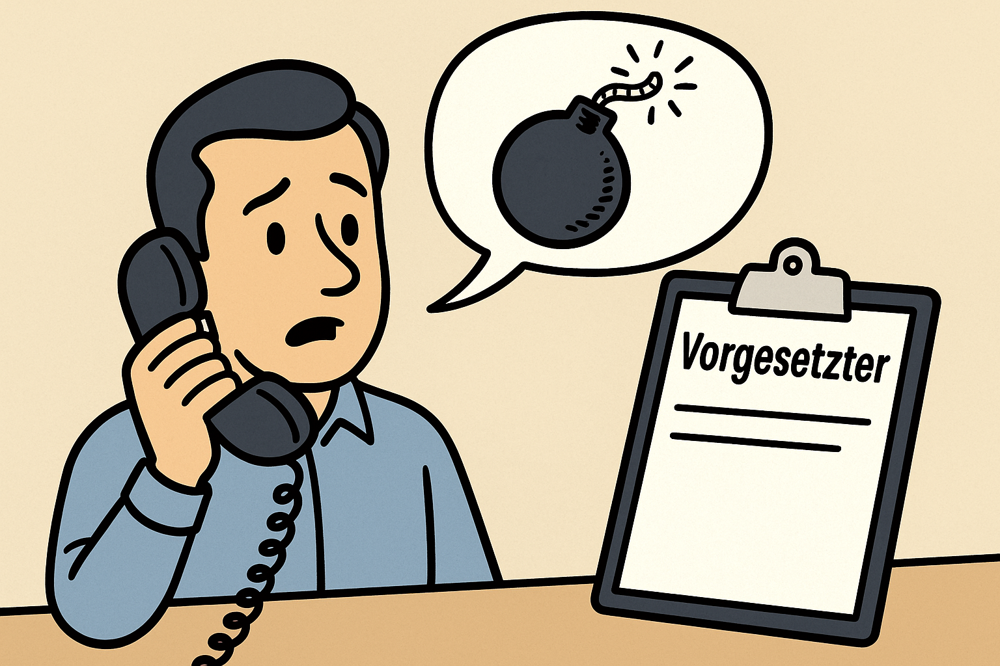

    --{{6}}--
Im Falle eines Amoklaufs ist die Polizei (110) und die Verwaltung des BTZ Pirna (intern 471 oder extern 3501 4618870) zu informieren.

     {{6-7}}

    --{{7}}--
Das Tragen und Nutzen von Zeichen und Materiealien (Bekleidung, Bild- und Tonträger, Bücher, Grußformen, Parolen, Propagandamittel und Formulierungen der Volksverhetzung u.a.), die darauf schließen lassen, dass ein Kontakt zu extremistischem Gedankengut bzw. Gruppierungen besteht, ist verboten.

     {{7-8}}

    --{{8}}--
Das Rauchen ist, mit Ausnahme in den festgelegten Raucherzonen, im gesamten Objekt verboten.

     {{8-9}}
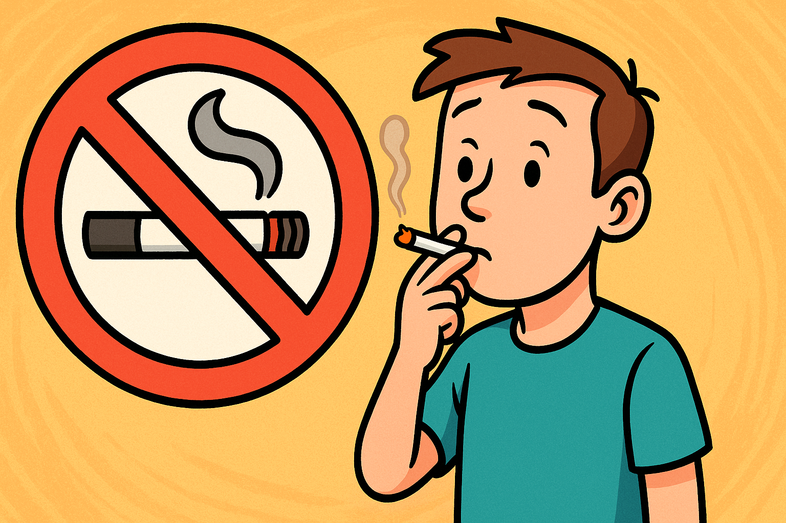

    --{{9}}--
Der Konsum von alkoholischen Getränken und sonstiger Rauschmittel ist grundsäztlich verboten.
Dieses Verbot schließt den Vertrieb oder die Weitergabe sonstiger Rauschmittel ein.
Verstöße gegen das Betäubungsmittelgesetz werden zur Anzeige gebracht.

     {{9-10}}
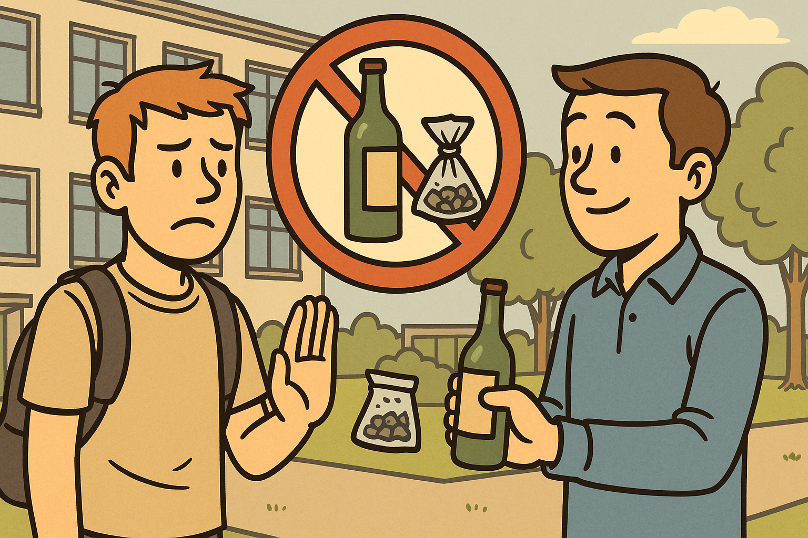

    --{{10}}--
Waffen jeglicher Art, auch Schreckschuss- oder Luftdruckwaffen, sind im Objekt verboten.

     {{10-11}}

    --{{11}}--
Im Gelände gilt die STVO, das Abstellen von Fahrzeugen geschieht auf eigenen Gefahr.
Widerrechtlich abgestellte Fahrzeuge werden kostenplichtig abgeschleppt.
Außerhalb der Lehrganzeiten sind die Einfahrtstore geschlossen.
In dieser Zeit sind das Befahren des Geländes mit Kraftfahrzeugen sowie das Parken grundsätzlich nicht gestattet.

     {{11-12}}

    --{{12}}--
Die Handwerkskammer Dresden haftet nicht für abhanden gekommene Sachen und Wertgegenstände (Bekleidung, Wertsachen, etc.).

     {{12-13}}

    --{{13}}--
Während des Unterrichts und bei Prüfungen sind Handys grundsätzlich abzuschalten.

      {{13}}
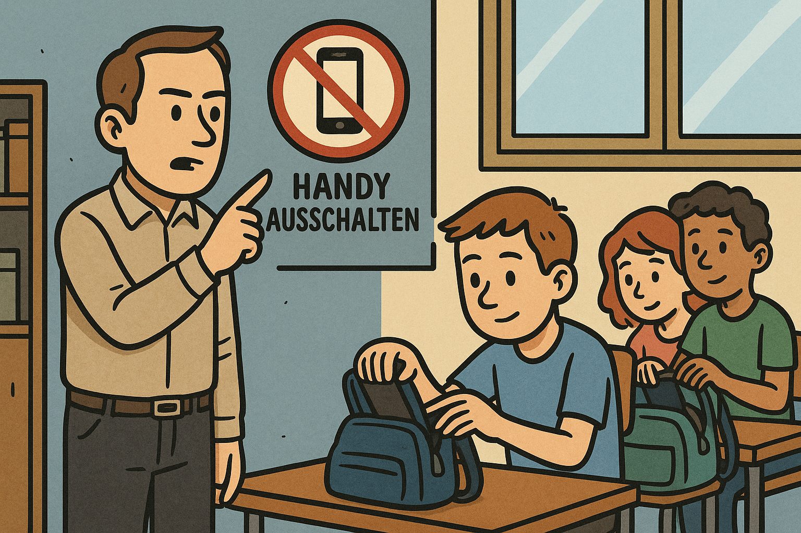

## II. Werkstatt- und Laborordnung

    --{{0}}--
Den Weisungen der Lehrer/Ausbilder ist unbedingt Folge zu leisten.

     {{0-1}}

    --{{1}}--
Die Bedienung der Unterrichtstechnik obliegt ausschließlich den Dozenten.

     {{1-2}}

    --{{2}}--
Sicherheits- und Arbeitsschutzbestimmungen sowie Werkstattordnungen und Belehrungen des Ausbilders sind einzuhalten.

     {{2-3}}
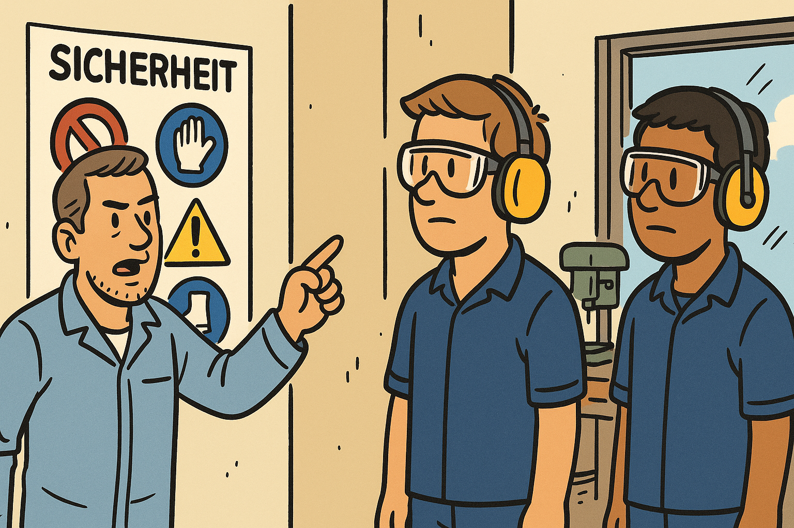

    --{{3}}--
In den Werkstätten, Computerkabinetten bzw. Laboren ist das Essen nicht gestattet.
Nutzen Sie die Pausenecken bzw. den Speisesaal.

     {{3-4}}
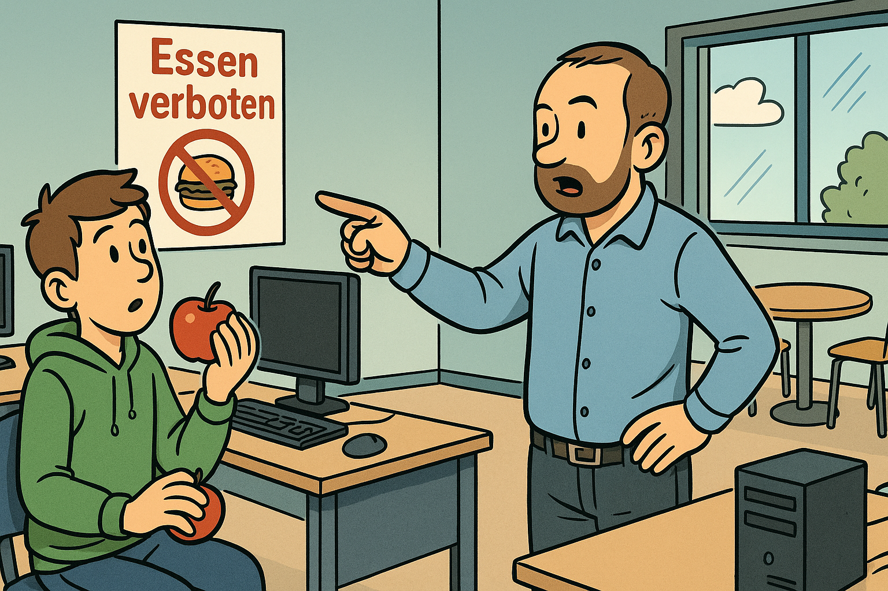

    --{{4}}--
Die Aufstellung der Tische und Stühle in den Seminarräumen ist beizubehalten.

     {{4-5}}
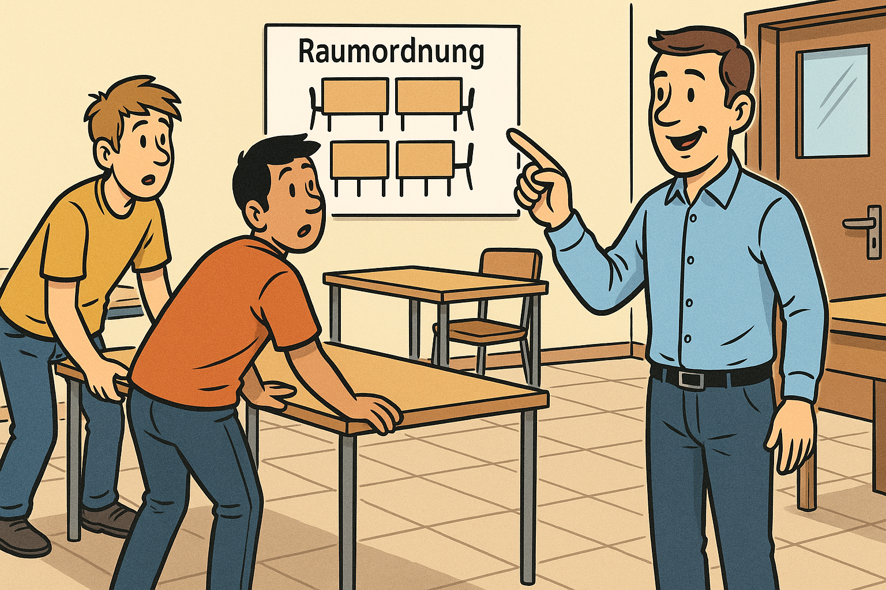

    --{{5}}--
Der Aufenthalt in Werkstätten und Labors sowie im Computerkabinet sowie as Arbeiten am Computer sind nur in Anwesenheit und nach Aufforderung des Dozentent/Ausbilders gestattet.

     {{5-6}}

    --{{6}}--
Es ist unzulässig selbständig Software auf dem Computer zu installieren oder Kopien installierter Software zu erstellen.
Des Weiteren ist das Herunterladen von Daten jeglicher Art aus sowie das Surfen auf pornographischen, gewaltverherrlichenden oder extremistischen Seiten im World Wide Web verboten.

     {{6-7}}

    --{{7}}--
Gewaltanwendungen jeglicher Art sind verboten.
Teilnehmer haften für mutwillig beschädigte oder entwendete Werkstatt- bzw. Laboreinrichtungen und Gegenstände in Höhe des Wiederbeschaffungswertes.

     {{7-8}}
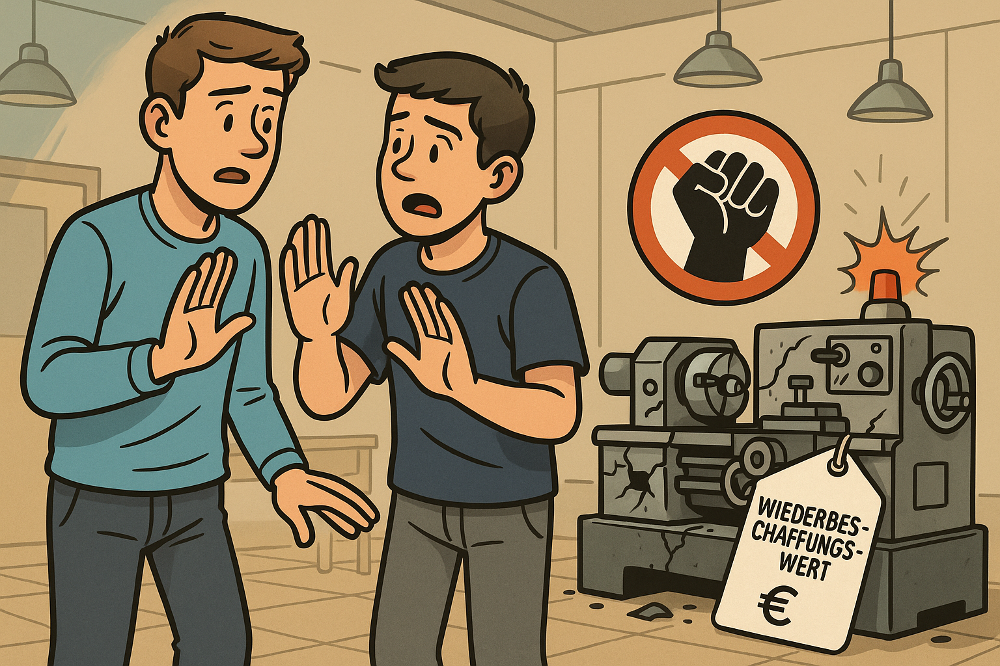

    --{{8}}--
Die Werkstätten des BTZ Prina dürfen nur mit Arbeitsschutzbekleidung sowie Arbeitsschutzschuhen betreten werden.

     {{8-9}}

    --{{9}}--
Die jeweils geltenden aushängenden Betriebsanweisungen sind zu beachten.

     {{9-10}}

    --{{10}}--
Bei Fehlzeiten während der Ausbildung sind entsprechende Nachweise zu erbringen.

     {{10-11}}
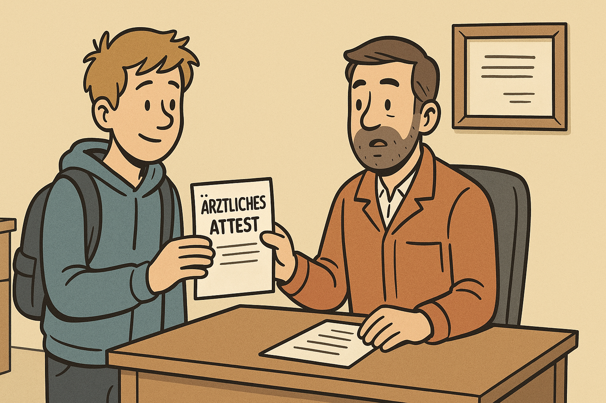

    --{{11}}--
Beim Verlassen des Objekts ist der zuständige Ausbilderzu informieren, ohne Abmeldung kein Versicherungsschutz.

     {{11-12}}

    --{{12}}--
Im Übrigen gilt die öffentliche aushängende Haus- und Brandschutzordnung der Handwerkskammer Dresden in der jeweils gültigen Fassung

     {{12-13}}

    {{|> 13}}
> __Berücksichtigung von Beeiträchtigungen__
>
> Bitte informieren Sie Ihren Ausbilder über individuelle Beeinträchtigungen (z.B. Medikamenteneinnahme, körperliche Behinderungen), die bei der Durchführung des ÜLU-Kurses berücksitigt werden müssen.
>
> Diese Information wir selbstverständlich vertraulich behandelt.
